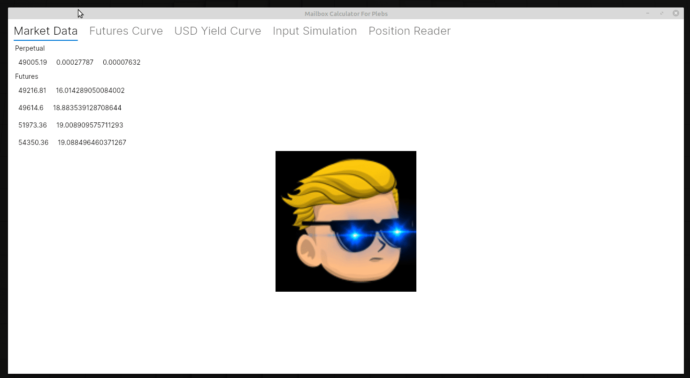

# Mailbox Calculator for plebs
The application receives some messages and then calculates some stuff.
In the future, the application might also send some messages after the user did some calculations.

## Phase 1: DBV
*(DBV = Deep Building Value*)
- [X] Real Time Market Data
    - [X] Perpetual, including current funding and average 8H funding
    - [X] Futures, including annualised premium
- [X] Real Time Futures Curve
    - [X] Contango/Backwardation curve
- [X] USD Yield Curve
    - [ ] Using Future spreads
- [ ] Input Simulation
    - [ ] Insert HODL
    - [ ] Write Call Option
- [ ] Position reader
    - [ ] Black Scholes Model
    - [ ] Writing Naked Call
    - [ ] Covered Call

## Demo

## Phase 2: Do it again
- [ ] Position reader
  - [ ] Bear Put Spreads
- [ ] After the above is done, rewrite the entire thing with a proper design.
- [ ] Push to github
